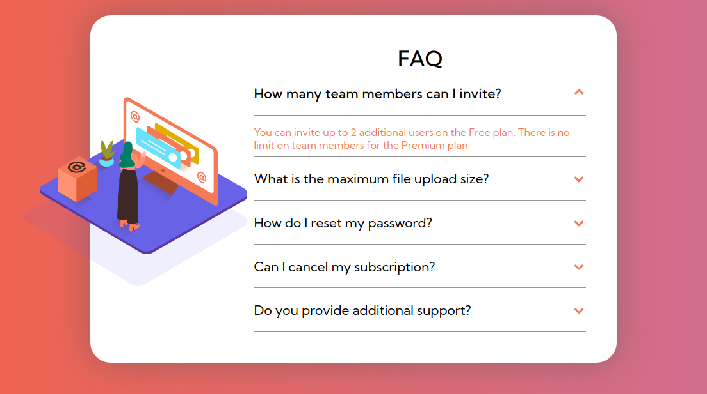

# Simple FAQ UI
Simple Page with Faq's made with ```HTML``` ```Sass``` ```JavaScript```

## Overview

This is a Simple FAQ pages UI Template , can be added with any website with their FAQ's . <br>

This is a FrontendMentor Challenge Which i completed with some changes

This canbe added with any website with some changes in colors in the main pages color scheme & with their personalized FAQ's

## Links

- View Code :    [Code](https://github.com/pritambera2000/Frontend_Practices/tree/main/FAQ-Page)
- Live Site URL   :   [FAQ's](https://faqbypritam.netlify.app/)


## Built with

- Semantic HTML5 markup
- [SCSS](https://sass-lang.com/) - CSS with superpowers 
- Flexbox , Grid
- Mobile-first workflow
- [Netlify](https://app.netlify.com/) - For Deployment
## Screenshots




<!-- 
 -->

## What I learned
BrushedUp some basic Concepts of CSS/JS
## Deployment Status
[](https://app.netlify.com/sites/faqbypritam/deploys)

